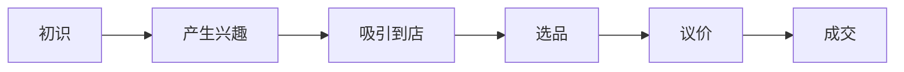

# 目前家具店的主流模式思考（不断完善中）

## 一、一个完整的交易流程

## 二、如何快速了解目前家具行业的情况以及主流的模式

### 1、知己知彼，百战不殆

找到目前做的比较好的家具店，研究它的运营模式

- 本地商家

  - 内江东盛娇子沙发厂
  - 内江市中区龙田家具经营部
  - 自贡红太阳源头工厂
  - 内江红太阳家具批发城

- 网络商家
  - 孙耀说家具（明星同款，国外 20 万，这里去个零）

### 2、从哪几个维度分析他们的运营模式

#### 1、模式上:人、货、场

目前主流的人、货、场：

- **人**：新增加视频拍摄剪辑、直播职能，拍摄和直播将成为商家必备技能
- **货**：主打性价比、网红款
- **场**：场再这个阶段发生了重要的变化。原来的主流家具卖场是大商场店中店、独立店以品牌为主。现在随着消费降级，现在的主流卖场是**家具超市**、**仓储店**、**源头工厂店**为主，本质还是给人一种性价比高的感觉，但并不意味着这些店的产品真的很便宜。

#### 2、运营上：如何引流？如何转化？使用了哪些工具和手段？

1. 引流（如何引流）

- 线上
  - 自媒体时代（需要着重讲解，用洗脑的方式运营自媒体），各平台的**直播**和**短视频**，这是目前最主流的方式。直播也已经出现员工全天轮替直播
- 线下
  - 传统的行销、电销、传单、广告（目前已经基本无效了，每一种方式在大家都经历和使用后就会变得没有效果，类似物以稀为贵，也有信息差因素）
  - 主题活动（和肾上腺素一样）

2. 转化（如何转化）

- 产品、质量
- 转化的最终目的都是为了吸引到店成交（实体店是这样），线上店省略这一步，直接就是选品下单。转化主要就是看使用什么工具和手段

3. 工具和手段（比较零碎，后期完善）

- 专业的电子相册
- 完善的供应链
- 产生信任的标语
- 一个 600，两个 1000
- 定位，差异化，为什么找你买而不是别人？

#### 3、服务上

- 普通的售后服务和极致的售后服务

## 三、了解之后，整合转化

### 1、目前自己的劣势和不足

- 人货场都存在问题，但人和场较明显，场上的问题，品牌优势减弱，叙事不再吸引人（根本）
  - 现在品牌店是如何做的？
- 引流上出现问题
- 转化上存在不足（竞争力低下的体现-产品、价格）

### 2、如何完善？

- 概率

  我强调概率这个概念，无论是什么政策、措施、方式都是对大部分问题的一种解决方式，不可能完全覆盖并解决。生意也是，好的经营方式能让大多数的人购买你的产品和服务，这是一个概率问题，我们所做的一切就是在增大这个概率。同样的道理，并不意味着你做的不好就一定没有生意，只是体量会非常小，如果还不够开支，那就会产生亏损。

  在以前市场足够大的时候，大家不需要太多的竞争就可以获取足够的客户赚取足够的钱，但现在情况截然相反，你付出了很多的努力却抢不到几个客户。现在的竞争更加激烈，这也是未来很长一段时间的发展趋势。

- 极致服务和售后

  无忧退换+家具公益维修
  相当于从服务端差异化，刚好这个维度消费者在意但竞争没那么大，增强消费者购买信心，同时家具公益维修可以增加视频素材，多样性的家具损坏增加新鲜感，利他性容易增粉，客户认可易于打造人设，也容易形成自传播。产品视频谁都可以拍，但对于竞争者来说要老板亲自下场售后是有难度的，拥有自然的壁垒。视频要形成自己的特色，产生特征。
