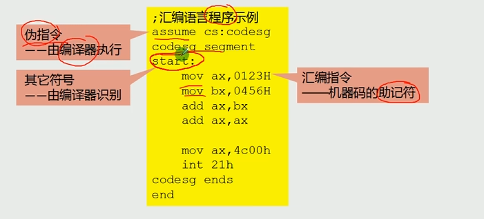
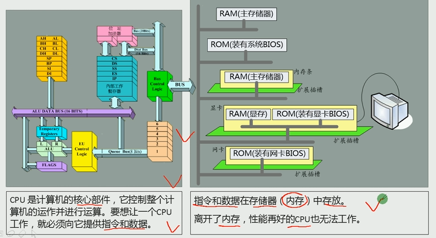
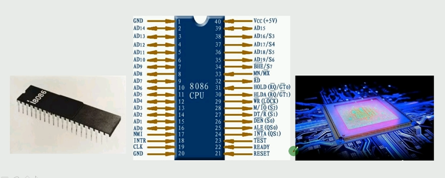
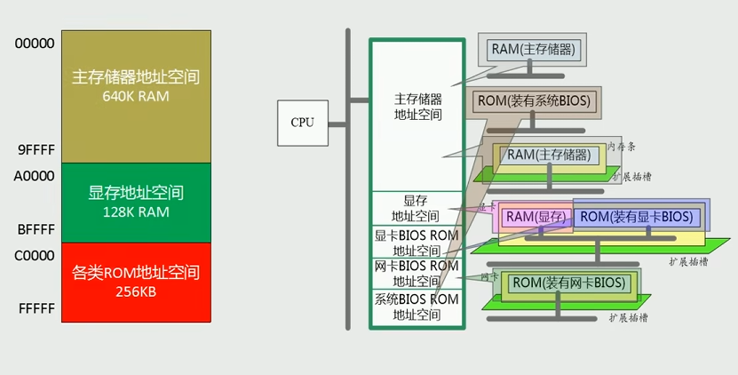

# 基础知识

汇编语言是直接在硬件之上工作的编程语言，研究重点是如何利用硬件系统的编程结构和指令集有效地控制系统工作。

## 机器语言与汇编语言

**机器指令**是 CPU 能直接执行的指令，通常以二进制形式表示,例如: `1000100111011000`，CPU 将其转变为高低电平脉冲来驱动运算。每种 CPU 都有自己的机器指令集。

**机器语言**是机器指令的集合，直接由 CPU 执行，但难以辨别和记忆。

**汇编语言**是为了解决机器语言难以辨别和记忆的问题而产生的。

- 汇编语言的主体是**汇编指令**
- 汇编指令是机器指令的助记符（如 `mov ax, bx`），由**汇编器**翻译成机器码。

例如:

```asm
机器指令 `1000100111011000`
操作: 将寄存器 bx 的值送入 ax
汇编指令 `mov ax, bx`
```

### 汇编语言的组成



| 类型         | 说明                                                                     |
| ------------ | ------------------------------------------------------------------------ |
| **汇编指令** | 机器码的助记符，有对应的机器码，由 CPU 执行                              |
| **伪指令**   | 无对应机器码，由编译器执行，CPU 不执行（如 `segment`, `ends`, `assume`） |
| **其他符号** | 如 `+`, `-`, `*`, `/`，由编译器识别，无对应机器码                        |

### 指令和数据的表示

同一段二进制，既可以是数据，也可以是指令——由程序员根据上下文决定：

```asm
; 同一段二进制 1000100111011000
1000100111011000  →  89D8H        ; 当作数据时
1000100111011000  →  mov ax, bx   ; 当作指令时（汇编器解码结果）
```

数据的表示方式多种多样，常见的有：

| 表示方式 | 说明                                   | 示例                |
| -------- | -------------------------------------- | ------------------- |
| 二进制   | 0 和 1 的序列,`B`结尾                  | `1000100111011000B` |
| 十六进制 | 每 4 位二进制对应 1 位十六进制,`H`结尾 | `89D8H`             |
| 十进制   | 人类习惯的数字表示,`D`结尾             | `35288D`            |
| 八进制   | 每 3 位二进制对应 1 位八进制,`O`结尾   | `211330O`           |

> 4位二进制对应1位十六进制，3位二进制对应1位八进制。十进制没有固定的位数对应关系。

## 计算机组成模型



## 存储器

指令和数据都存放在存储器中（内存或磁盘）。

- **存储单元**：存储器被划分成若干个存储单元，从 0 开始顺序编号，每个单元存储 **8 个二进制位（1 字节）**
- 随机存储器（**RAM**）：可读可写，断电丢失（主内存）
- 只读存储器（**ROM**）：只读，断电不丢失（BIOS 等固件）

## 总线

**总线**是 CPU 与外部芯片（RAM、ROM、显卡等）通信的通道，在物理上是一根根导线(引脚)的集合



CPU 进行数据读写，必须通过**总线**和外部芯片交互，逻辑上分为三种：

| 总线         | 传递内容            | 决定能力                                                |
| ------------ | ------------------- | ------------------------------------------------------- |
| **地址总线** | 存储单元的地址      | n 根地址线 → 最多寻址 2ⁿ 个内存单元                     |
| **数据总线** | 读或写的数据        | 宽度决定一次可传送的数据量（如 16 位总线一次传 2 字节） |
| **控制总线** | 读/写命令，选中芯片 | 宽度决定 CPU 对外部器件的控制种类数                     |

**8086 CPU** 有 **20 根地址线**，最大寻址能力为 **2²⁰ = 1MB**。

## CPU对存储器的读写

CPU要想进行数据的读写,必须和外部器件进行三类信息的交互：

1. **地址信息**：通过地址总线传递，告诉外部器件要访问哪个存储单元
2. **控制命令**：通过控制总线传递，告诉外部器件是读操作还是写操作，以及选中哪个器件
3. **数据内容**：通过数据总线传递，告诉外部器件要读写什么数据

例如:

```asm
; 读操作示例
mov ax, [0]     ; 1. 地址信息：访问内存地址
                ; 2. 控制命令：CPU 发出读命令，选中内存芯片
                ; 3. 数据内容：将地址处的数据读入 ax
; 写操作示例
mov [0], ax     ; 1. 地址信息：访问内存地址
                ; 2. 控制命令：CPU 发出写命令，选中内存芯片
                ; 3. 数据内容：将 ax 中的数据写入地址处
```

## 内存地址空间

对于 CPU 来讲，系统中所有存储器（主板 RAM、扩展槽 RAM、ROM、显存等）都连在总线上，CPU 将它们统一看做一个**逻辑存储器**，称为**内存地址空间**。

**内存地址空间分配方案（8086 CPU）：**



| 内存区域              | 内容                       |
| --------------------- | -------------------------- |
| 主板 RAM              | 大部分程序和数据           |
| 显卡 RAM（显存）      | 屏幕显示内容               |
| 主板 ROM（系统 BIOS） | 基本输入/输出程序          |
| 各接口卡 ROM          | 各自的 BIOS（如显卡 BIOS） |

> CPU 对它们一视同仁，用同样的内存读写指令访问，地址统一编排。

## 接口卡

CPU 无法直接控制外设（显示器、键盘、打印机等），而是通过**接口卡**间接控制：

```
CPU ←→ 总线 ←→ 接口卡 ←→ 外设
```

接口卡安插在主板的扩展插槽中，通过总线与 CPU 通信。

## 关键概念速查

| 概念     | 说明                              |
| -------- | --------------------------------- |
| 寻址能力 | 地址总线宽度 n → 最多 2ⁿ 个单元   |
| 传输带宽 | 数据总线宽度 n → 一次传 n/8 字节  |
| 编译器   | 将汇编指令翻译成机器码            |
| 汇编器   | 同编译器，专指汇编语言的编译程序  |
| 连接器   | 将多个 `.obj` 文件合并生成 `.exe` |
