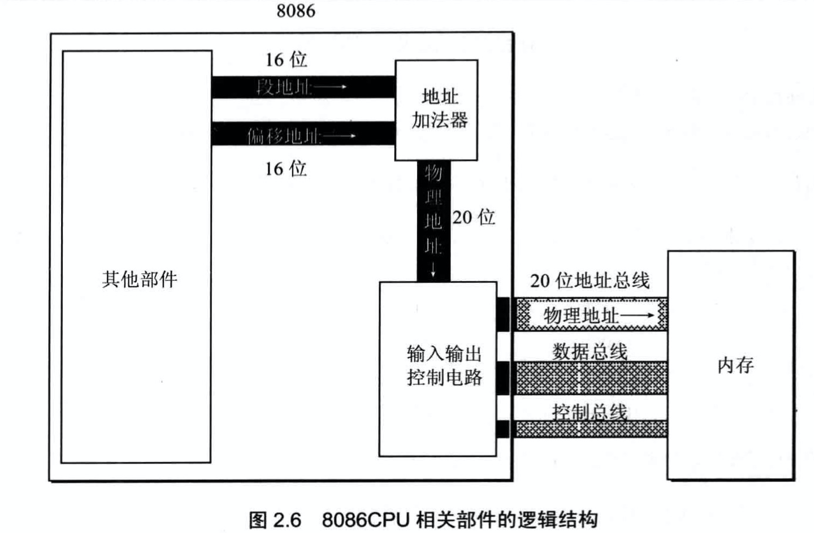
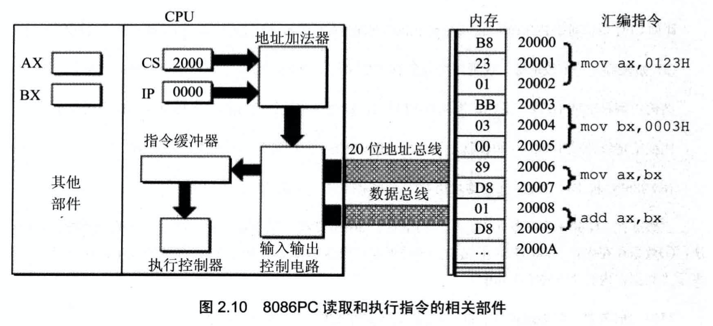
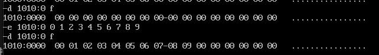
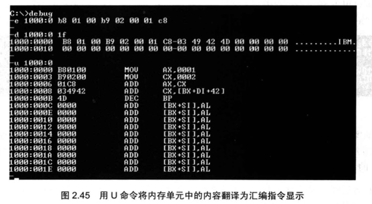
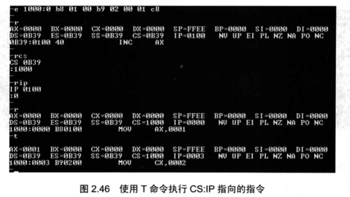
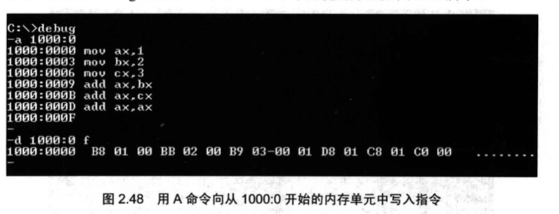

# 寄存器

寄存器(Register)是 CPU 内部的高速存储器，用于临时存储指令、数据和地址。

一个典型的 CPU 由运算器、控制器、寄存器等器件构成，通过**内部总线**相连。

| 部件   | 作用                               |
| ------ | ---------------------------------- |
| 运算器 | 进行信息处理（加减乘除、逻辑运算） |
| 寄存器 | 临时存储信息                       |
| 控制器 | 协调各器件工作                     |

**CPU 的五阶段流水线（理解 CPU 工作原理）：**

1. 取指令（Fetch）— 从内存取出指令
2. 指令译码（Decode）— 解析操作码
3. 执行指令（Execute）— 运算
4. 访存取数（Memory Access）— 读写内存
5. 结果写回（Write Back）— 写入寄存器

8086 CPU 共有 **14 个寄存器**，全部为 **16 位**：

```
AX  BX  CX  DX  SP  BP  SI  DI  IP  FLAG  CS  DS  SS  ES
```

## 通用寄存器

AX / BX / CX / DX 这 4 个寄存器可以分拆成两个独立的 8 位寄存器：

| 16 位 | 高 8 位 | 低 8 位 |
| ----- | ------- | ------- |
| AX    | AH      | AL      |
| BX    | BH      | BL      |
| CX    | CH      | CL      |
| DX    | DH      | DL      |

**8086 可处理两种数据宽度：**

| 名称         | 大小           | 存放位置           |
| ------------ | -------------- | ------------------ |
| 字节（byte） | 8 位           | 8 位寄存器，如 AL  |
| 字（word）   | 16 位 = 2 字节 | 16 位寄存器，如 AX |

> **小端模式（Little Endian）：** 8086 采用小端存储——低地址存放低字节，高地址存放高字节。
>
> 类比 Rust：x86 平台上 `u16::to_le_bytes()` 就是小端顺序。

### AX — 累加寄存器

乘法/除法的结果存入 AX（以及 DX）；函数调用的返回值通常存入 AX。

```asm
; 乘法后结果在 AX（16位结果）或 DX:AX（32位结果）
mov ax, 10
mov bx, 20
mul bx          ; AX = 10 * 20 = 200（无符号乘法）

; 除法
mov ax, 200
mov bl, 10
div bl          ; AL = 商(20)，AH = 余数(0)
```

### BX — 寻址寄存器

BX 可用于内存寻址：`[bx]` 以 BX 作为偏移地址访问内存（DS 提供段地址）。

```asm
mov bx, 2
add bx, bx      ; bx = 4
mov ax, bx

; 用 bx 寻址
mov bx, 0
mov ax, [bx]    ; 读取 DS:0 处的字
```

### CX — 计数寄存器

CX 专用于 `loop` 循环计数：

```asm
; 计算 1+2+...+10
mov cx, 10      ; 循环 10 次
mov ax, 0
mov bx, 0

s:  add bx, cx  ; bx = bx + cx
    loop s      ; cx--，若 cx≠0 跳回 s
; 循环结束后 bx = 55
```

### DX — 高位/余数寄存器

- 乘法：高 16 位结果存入 DX（DX:AX 存放 32 位结果）
- 除法：余数存入 DX（16 位除法时）

## 段寄存器（CS / DS / SS / ES）

段寄存器存放**段地址**，配合偏移地址访问内存。

| 段寄存器 | 全称          | 用途                               |
| -------- | ------------- | ---------------------------------- |
| CS       | Code Segment  | 代码段，与 IP 配合指向当前指令     |
| DS       | Data Segment  | 数据段，`mov ax, [bx]` 默认使用 DS |
| SS       | Stack Segment | 栈段，与 SP 配合指向栈顶           |
| ES       | Extra Segment | 附加段，串操作的目标地址           |

```asm
; 显式指定段寄存器前缀
mov cs:[xxx], ax
mov ds:[xxx], ax
mov ss:[xxx], ax
mov es:[xxx], ax
```

> **Windows 平坦模式说明：** 现代 Windows 使用平坦内存模型（Flat Memory），段寄存器的值都为 0，直接用偏移地址定位内存（32/64 位偏移）。本书基于 8086 的分段模式，理解这个差异有助于读懂逆向工程中的反汇编代码。

## 偏移/索引寄存器

BP / SP / SI / DI 这 4 个寄存器存放段内偏移量，配合段寄存器访问内存。

| 寄存器 | 全称              | 常用场景                       | 默认段 |
| ------ | ----------------- | ------------------------------ | ------ |
| SP     | Stack Pointer     | 始终指向栈顶                   | SS     |
| BP     | Base Pointer      | 访问栈帧中的局部变量和函数参数 | SS     |
| SI     | Source Index      | 源字符串地址（串操作）         | DS     |
| DI     | Destination Index | 目标字符串地址（串操作）       | ES     |

### SP — 栈顶指针

SP 始终指向栈顶，push 时 SP-=2，pop 时 SP+=2（栈从高地址向低地址生长）。

> 类比 Rust：Rust 函数调用时，编译器生成的汇编代码会用 RSP（64 位的 SP）管理调用栈。

### BP — 栈帧基址寄存器

`[bp-xx]` 访问局部变量，`[bp+xx]` 访问函数参数：

```asm
; 进入函数时的经典序言（prologue）
push bp         ; 保存上一个帧的 bp
mov  bp, sp     ; bp 指向当前栈帧
; [bp+6] = 第一个参数，[bp-2] = 第一个局部变量
```

### SI / DI — 字符串源/目标寄存器

常配合 `rep movsb` 实现内存复制：

```asm
; 复制字符串（源→目标）
mov cx, 11      ; 字符串长度
rep movsb       ; 重复：(ES:DI) = (DS:SI)，SI++，DI++
```

## 物理地址的计算

8086 CPU 有 **20 位地址总线**，但内部寄存器只有 16 位。通过**地址加法器**将两个 16 位地址合成 20 位物理地址：

**物理地址 = 段地址\*16 + 偏移地址**

`段地址 × 16` 等同于将段地址左移 4 位（十六进制左移一位）。

**同一物理地址可由不同段地址+偏移表示：**

| 物理地址 | 段地址 | 偏移地址 |
| -------- | ------ | -------- |
| 21F60H   | 2000H  | 1F60H    |
| 21F60H   | 2100H  | 0F60H    |
| 21F60H   | 21F0H  | 0060H    |
| 21F60H   | 21F6H  | 0000H    |



**最大寻址范围：** 偏移地址 16 位，变化范围 `0~FFFFH`，即每个段最多寻址 **64KB**。

## CS 和 IP：最关键的寄存器

`CS:IP` 始终指向 CPU **下一条要执行的指令**：

- `CS`（Code Segment）：代码段地址
- `IP`（Instruction Pointer）：指令偏移地址

任意时刻，CPU 把 `CS:IP` 指向的内容当做指令执行。



### 修改 CS:IP

```asm
jmp 段地址:偏移地址    ; 同时修改 CS 和 IP
                       ; 如 jmp 2000:0 → CS=2000H，IP=0000H

jmp ax                 ; 只修改 IP，IP = (ax) 的值
                       ; 执行前: ax=1000H → 执行后: IP=1000H
```

## Debug 命令详解

Debug 是 DOS/Windows 提供的调试工具，可以在机器码级别跟踪程序执行。

| 命令              | 作用                      | 示例                 |
| ----------------- | ------------------------- | -------------------- |
| `-r`              | 查看所有寄存器            | `-r`                 |
| `-r 寄存器`       | 修改某个寄存器的值        | `-r ax` → 输入新值   |
| `-d 段:偏移`      | 查看内存（默认 128 字节） | `-d 1000:0`          |
| `-d 段:起止`      | 查看指定范围内存          | `-d 1000:0 1f`       |
| `-e 地址 数据...` | 修改内存内容              | `-e 1000:0 11 22 33` |
| `-u 地址`         | 反汇编（机器码→汇编）     | `-u cs:0`            |
| `-t`              | 单步执行一条指令          | `-t`                 |
| `-a 地址`         | 以汇编格式写入指令        | `-a 1000:0`          |








