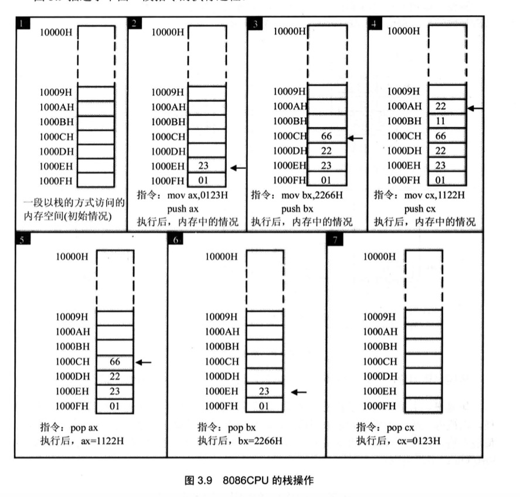
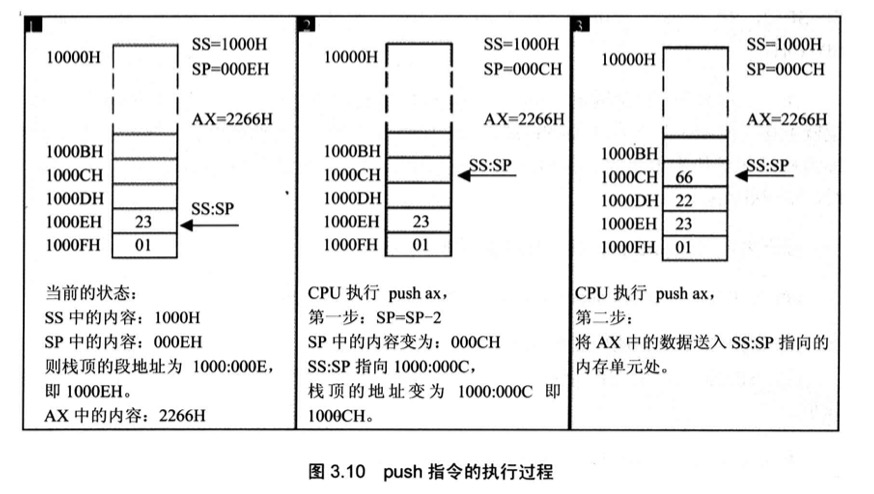
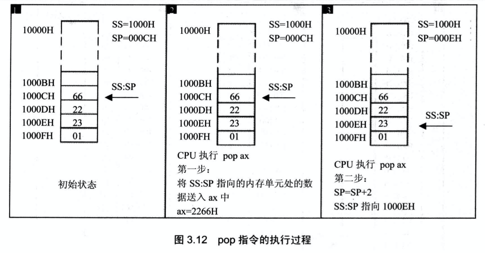
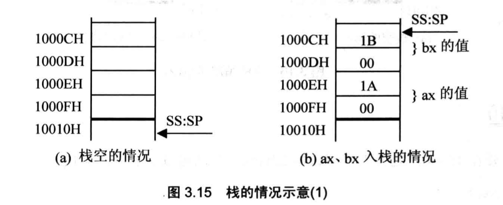

# 寄存器（内存访问）

从内存访问的角度了解寄存器：DS、SS、SP，以及栈的工作机制。

## 内存中字的存储

CPU 用 16 位寄存器存储一个**字（Word）**：高 8 位存高字节，低 8 位存低字节。

由于内存单元是**字节单元**，一个字需要 2 个**连续**内存单元存放：

- N 号单元存放低字节
- N+1 号单元存放高字节（**小端模式**，低地址存低字节）

> Rust 中 `u16` 在内存里也是小端存储（x86），低字节在低地址。

例如: `1234H` 存在内存中时，`34H` 存在低地址，`12H` 存在高地址：

```
地址    内容
1000H   34H  ← 低字节
1001H   12H  ← 高字节
```

这样设计的原因是：8086 CPU 以**字节为单位**访问内存，访问一个字(2 字节)时需要两次访问（先访问低字节，再访问高字节）。小端模式使得访问低字节的指令更简单（只需一次访问），而访问高字节则需要两次访问。

## DS 寄存器与 `[address]` 寻址

`DS`（Data Segment）寄存器存放数据段的**段地址**，配合偏移地址访问内存。

读取内存 `10000H` 中的内容：

```asm
mov bx, 1000H      ; 不能直接 mov ds, 1000H（不能立即数→段寄存器）
mov ds, bx         ; ds = 1000H
mov al, [0]        ; 读取 ds:0 即 1000:0 → 物理地址 10000H
```

**mov/add/sub 的合法形式：**

| 指令形式                 | 示例          |
| ------------------------ | ------------- |
| `mov 寄存器, 数据`       | `mov ax, 8`   |
| `mov 寄存器, 寄存器`     | `mov bx, ax`  |
| `mov 寄存器, 内存单元`   | `mov ax, [0]` |
| `mov 内存单元, 寄存器`   | `mov [0], ax` |
| `mov 段寄存器, 寄存器`   | `mov ds, ax`  |
| `mov 寄存器, 段寄存器`   | `mov ax, ds`  |
| `mov 内存单元, 段寄存器` | `mov [0], ds` |
| `add 寄存器, 内存单元`   | `add ax, [0]` |
| `sub 内存单元, 寄存器`   | `sub [0], ax` |

> `[...]` 表示内存单元，`[0]` 中的 0 是偏移地址，段地址来自 DS。

## DS与数据段

可以将一段内存（起始地址是 16 的倍数，长度 ≤ 64KB）定义为数据段，用 DS 指向它。

**示例：** 累加 `123B0H~123B2H` 三个单元的数据

```asm
mov ax, 123BH
mov ds, ax         ; ds 指向 123BH 段
mov al, 0          ; 累加器清零
add al, [0]        ; 加 123B0H 的内容
add al, [1]        ; 加 123B1H 的内容
add al, [2]        ; 加 123B2H 的内容
```

## 栈：CPU 提供的栈机制

8086 CPU 可以将一段内存当作**栈**使用。入栈/出栈操作都以**字（2 字节）**为单位。

```asm
push ax    ; 将 ax 的值压入栈
pop  bx    ; 从栈顶弹出数据送入 bx
```

**执行示例：**

```asm
mov ax, 0123H
push ax           ; 栈顶 ← 0123H
mov bx, 2266H
push bx           ; 栈顶 ← 2266H
mov cx, 1122H
push cx           ; 栈顶 ← 1122H
pop ax            ; ax = 1122H（后进先出）
pop bx            ; bx = 2266H
pop cx            ; cx = 0123H
```



## SS 和 SP：栈顶寄存器

- `SS`（Stack Segment）：栈段的段地址
- `SP`（Stack Pointer）：栈顶的偏移地址
- 任意时刻 `SS:SP` 指向**当前栈顶元素**

### push 过程（栈从高地址向低地址生长）

```
1. SP = SP - 2               ← 栈顶向低地址移动
2. 将数据写入 SS:SP 处
```



### pop 过程

```
1. 读取 SS:SP 处的数据
2. SP = SP + 2               ← 栈顶向高地址移动
```



> pop 后，原栈顶位置的数据仍存在内存中，只是 SP 不再指向它——下次 push 时会被覆盖。

## push/pop 指令形式

| 指令              | 说明               |
| ----------------- | ------------------ |
| `push 寄存器`     | 寄存器内容入栈     |
| `pop 寄存器`      | 出栈，送入寄存器   |
| `push 段寄存器`   | 段寄存器内容入栈   |
| `pop 段寄存器`    | 出栈，送入段寄存器 |
| `push 内存字单元` | 内存字入栈         |
| `pop 内存字单元`  | 出栈，送入内存     |

```asm
mov ax, 1000H
mov ds, ax
push [0]           ; 将 1000:0 处的字压栈
pop  [2]           ; 出栈，结果送入 1000:2
```

## 栈空间超界问题

8086 CPU **不检查**栈操作是否越界。CPU 只知道 `SS:SP` 在哪里，不知道栈空间的边界。

SP 的变化范围最大为 `0~FFFFH`，越界后会覆盖其他数据段或代码段，需要程序员自行保证。

> 类比：Rust 的 `unsafe` 指针操作同样不做边界检查，安全性由程序员保证。

## 综合练习

**任务：** 将 `10000H~1000FH` 当作栈，将 `AX=001AH, BX=001BH` 入栈后清零，再从栈恢复

```asm
mov ax, 1000H
mov ss, ax
mov sp, 0010H      ; 初始化栈顶（栈空时 SP 指向栈底+1）

mov ax, 001AH
mov bx, 001BH

push ax            ; 001AH 入栈
push bx            ; 001BH 入栈

sub ax, ax         ; ax = 0（比 mov ax,0 少1字节机器码）
sub bx, bx         ; bx = 0

pop bx             ; bx = 001BH（后进先出，先弹 bx）
pop ax             ; ax = 001AH
```



## 三种段的使用总结

| 段类型 | 寄存器  | 用途                 |
| ------ | ------- | -------------------- |
| 代码段 | `CS:IP` | CPU 取指执行         |
| 数据段 | `DS`    | mov/add/sub 访问内存 |
| 栈段   | `SS:SP` | push/pop 操作        |

> 一段内存可以同时充当多种角色，完全由程序员通过设置 CS/DS/SS 决定。
