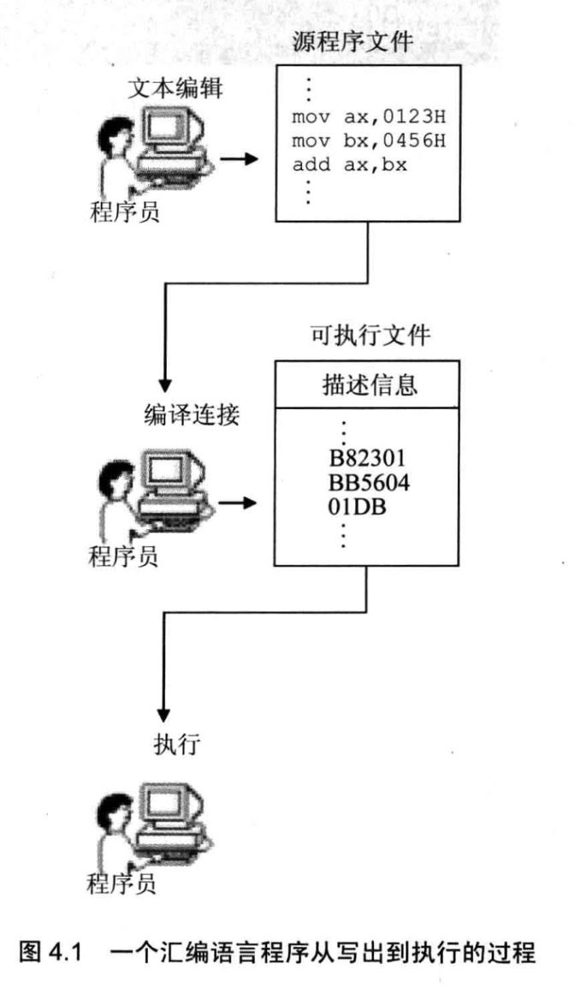
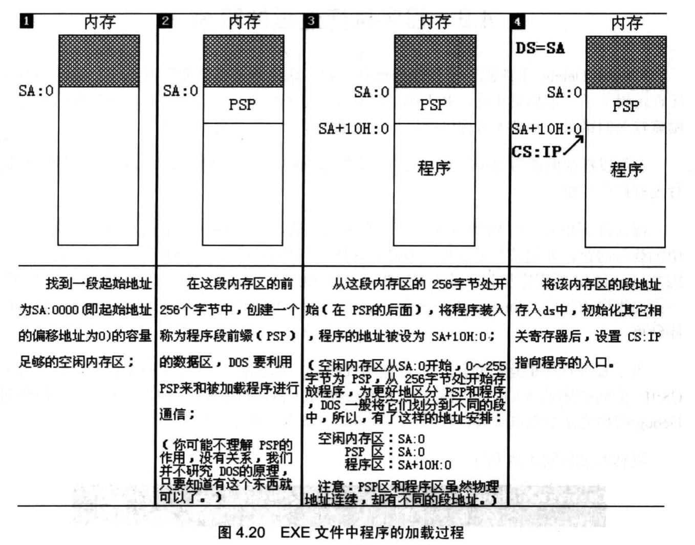

# 第一个程序

## 从编写到执行

```
编写 .asm 源文件
      ↓
masm 源文件;           →  .obj 目标文件（机器码 + 描述信息）
      ↓
link 目标文件;         →  .exe 可执行文件
      ↓
在 DOS 中执行 / 用 debug 跟踪
```



## 源程序结构

```asm
assume cs:codesg          ; 伪指令：将段寄存器 cs 和 codesg 段关联

codesg segment            ; 定义一个名为 codesg 的段，从此处开始

    mov ax, 0123h
    mov bx, 0456h
    add ax, bx
    add ax, ax

    mov ax, 4c00h
    int 21h               ; 程序返回 DOS（固定写法）

codesg ends               ; codesg 段到此结束

end                       ; 汇编程序结束标记
```

## 伪指令说明

| 伪指令                     | 用途                                                     |
| -------------------------- | -------------------------------------------------------- |
| `xxx segment` / `xxx ends` | 定义一个段，成对使用，必须有                             |
| `end`                      | 标记汇编源程序结束                                       |
| `assume`                   | 将段寄存器与指定段关联（仅告知编译器，不实际修改寄存器） |

## 程序返回

一个程序（P2）运行时由另一个程序（P1，通常是 DOS 的 `command.com`）加载。P2 运行完毕后，必须将 CPU 控制权还给 P1。

**固定的程序返回代码：**

```asm
mov ax, 4c00h
int 21h
```

## 标号

标号代表一个地址，如 `codesg segment` 中的 `codesg` 最终被编译为段地址。

可以用 `end start` 格式，通过标号 `start` 指明程序入口：

```asm
assume cs:code

code segment
start:                    ; 程序入口标号
    mov ax, 0123h
    mov bx, 0456h
    add ax, bx

    mov ax, 4c00h
    int 21h
code ends

end start                 ; 指明程序从 start 标号处开始执行
```

## 编译与连接

```shell
masm c:\hello;            ; 编译，生成 hello.obj（末尾分号=跳过中间文件询问）
link hello;               ; 连接，生成 hello.exe
```

**连接的主要作用：**

1. 将多个目标文件合并为一个可执行文件
2. 将程序调用的库文件中的子程序链接进来
3. 处理目标文件中不能直接用于执行的描述信息

## 程序的加载与运行

DOS 系统下，执行 `hello.exe` 时：

1. `command.com` 将 `hello.exe` 中的程序加载进内存
2. `command` 设置 `CS:IP` 指向程序第一条指令
3. 程序运行结束后，返回 `command`，CPU 继续执行 `command`



**内存布局：**

- 程序所在内存区的地址为 `DS:0`（程序加载后 DS 存放该内存区段地址）
- 内存区**前 256 字节**是 **PSP**（Program Segment Prefix），DOS 用于和程序通信
- PSP 之后是程序本身

## 语法错误 vs 逻辑错误

| 错误类型 | 何时发现           | 示例                         |
| -------- | ------------------ | ---------------------------- |
| 语法错误 | 编译时由编译器报告 | 指令拼写错误、缺少 `ends`    |
| 逻辑错误 | 运行时才暴露       | 计算逻辑错误、段地址设置错误 |

## 用 Debug 跟踪程序

```shell
debug hello.exe           ; 加载程序到 debug
-r                        ; 查看寄存器，确认 CS:IP 指向程序入口
-u cs:0                   ; 反汇编查看指令
-t                        ; 单步执行
-g                        ; 运行到程序结束
```
