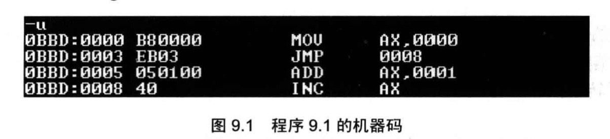
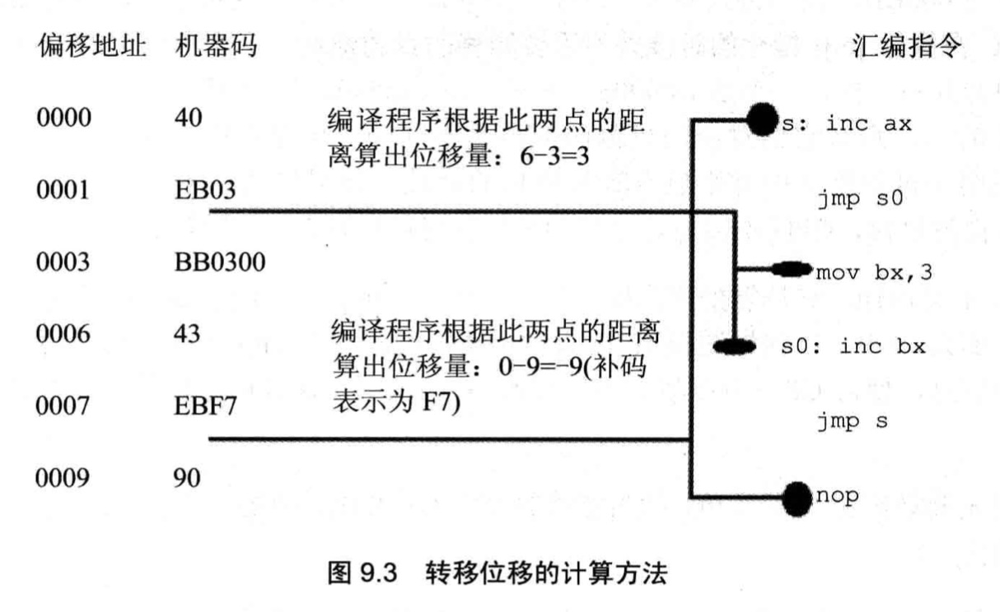
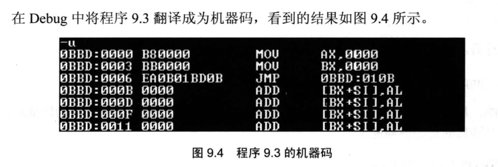
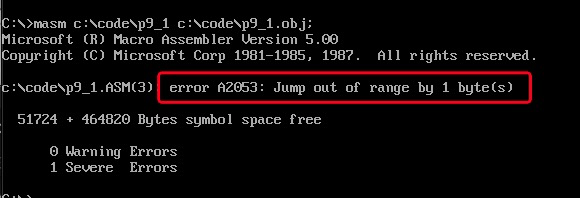

# 转移指令的原理

**转移指令**：可以修改 IP，或同时修改 CS 和 IP 的指令。

## 转移分类

| 类型               | 修改内容                       | 示例                |
| ------------------ | ------------------------------ | ------------------- |
| 段内短转移         | 只修改 IP，范围 `-128~127`     | `jmp short 标号`    |
| 段内近转移         | 只修改 IP，范围 `-32768~32767` | `jmp near ptr 标号` |
| 段间转移（远转移） | 同时修改 CS 和 IP              | `jmp far ptr 标号`  |

## 操作符 offset

`offset` 是编译器处理的伪指令，取得标号的**偏移地址**：

```asm
assume cs:codesg

codesg segment
start:  mov ax, offset start   ; 相当于 mov ax, 0（start 是段的起点）
     s: mov ax, offset s       ; 相当于 mov ax, 3（前一条指令 3 字节）
codesg ends
end start
```

## jmp 指令格式

### 1. 依据位移的短/近转移（机器码中存位移，不存目的地址）

```asm
jmp short 标号     ; 段内短转移，IP += 8位位移（-128~127）
jmp near ptr 标号  ; 段内近转移，IP += 16位位移（-32768~32767）
```

**关键：** 机器码中存的是**位移**，不是目的地址。

```
8位位移 = 标号地址 - jmp指令后第一个字节的地址
```

这样设计的好处：程序加载到内存任意位置都能正确执行（浮动装配）。





### 2. 目的地址在指令中的远转移

```asm
jmp far ptr 标号   ; CS = 标号所在段地址，IP = 标号偏移地址
```

机器码格式：`EA [偏移低字节] [偏移高字节] [段地址低字节] [段地址高字节]`

```asm
; 示例
assume cs:codesg
codesg segment
start:  mov ax, 0
        mov bx, 0
        jmp far ptr s       ; CS:IP 跳转到 s 标号处
        db 256 dup (0)
     s: add ax, 1
        inc ax
codesg ends
end start
```



### 3. 转移地址在寄存器中

```asm
jmp 16位寄存器      ; IP = (寄存器)，段内转移
jmp ax             ; IP = (ax)
```

### 4. 转移地址在内存中

```asm
; 段内转移：从内存读取 1 个字作为新 IP
jmp word ptr ds:[0]        ; IP = (ds:0处的字)

; 段间转移：从内存读取 2 个字，低字为 IP，高字为 CS
jmp dword ptr ds:[0]       ; IP = (ds:0处的字)，CS = (ds:2处的字)
```

## jcxz 指令（有条件短转移）

```asm
jcxz 标号   ; 若 (cx) = 0，则 IP += 8位位移，转移到标号；否则向下执行
```

等价于：

```c
if ((cx) == 0) jmp short 标号;
```

**示例：** 在 2000H 段中查找第一个值为 0 的字节

```asm
assume cs:code

code segment
start:
    mov ax, 2000h
    mov ds, ax
    mov bx, 0

s:  mov ch, 0
    mov cl, [bx]    ; 将当前字节送入 cx 的低位
    jcxz ok         ; 若 cx = 0（即 [bx] = 0），跳出
    add bx, 1
    jmp short s

ok: mov dx, bx      ; dx = 第一个值为 0 的字节的偏移
    mov ax, 4c00h
    int 21h
code ends
end start
```

## loop 指令（循环短转移）

```asm
loop 标号   ; (cx)--, 若 (cx)≠0 跳转到标号，否则向下执行
```

等价于：

```c
cx--;
if (cx != 0) jmp short 标号;
```

**示例：** 用 loop 查找第一个值为 0 的字节（与 jcxz 对比）

```asm
assume cs:code

code segment
start:
    mov ax, 2000h
    mov ds, ax
    mov bx, 0

s:  mov cl, [bx]
    mov ch, 0
    inc cx          ; cx+1，因为 loop 先 cx-1 再判断，防止 cx=1 时提前退出
    inc bx
    loop s

ok: dec bx          ; 多走了一步，回退
    mov dx, bx
    mov ax, 4c00h
    int 21h
code ends
end start
```

## 根据位移转移的意义（浮动装配）

```asm
mov cx, 6        ; B9 06 00
mov ax, 10h      ; B8 10 00
s: add ax, ax    ; 01 C0
   loop s        ; E2 FC      ← FC = -4（补码），表示向前跳 4 字节到 s
```

无论这段代码加载到内存哪个地址，`loop s` 的位移 `-4` 不变，都能正确执行。

## 编译器对转移超界的检测

若位移超出范围（如 `jmp short` 跨越超过 127 字节），编译器**报错**：

```asm
assume cs:code
code segment
start:  jmp short s     ; 编译错误：跳跃范围超过 -128~127
        db 128 dup (0)
     s: mov ax, 0ffffh
code ends
end start
```



## 现代应用：Inline Hook 原理

学完转移指令，可以理解逆向工程中的 **Inline Hook** 技术——通过修改函数开头的机器码，强制跳转到自定义函数（"劫持"执行流）。

**原理：** 将目标函数的前 5 字节替换为 `jmp 偏移`（机器码 `E9 xx xx xx xx`）。

```
目标函数原指令:  push ebp / mov ebp,esp / ...
修改后:          jmp [fake_func的偏移]  （5字节）/ ...
```

**位移计算：**

```
位移 = fake_func地址 - (目标函数地址 + 5)
```

### Win32 C++ InlineHook 示例（延伸阅读）

```cpp
/* 将原函数的前5字节替换为 jmp，劫持到 fake 函数 */
void InlineHook(DWORD dwHookAddr, LPVOID pFunAddr)
{
    BYTE jmpCode[5] = {0xE9};  // 0xE9 = JMP 近转移
    // 计算位移：fake地址 - (原地址 + 5)
    *(DWORD*)(&jmpCode[1]) = (DWORD)pFunAddr - dwHookAddr - 5;

    DWORD OldProtect = 0, dwWritten;
    // 代码段有写保护，先修改内存保护属性
    VirtualProtect((LPVOID)dwHookAddr, 5, PAGE_EXECUTE_READWRITE, &OldProtect);
    WriteProcessMemory(GetCurrentProcess(), (FARPROC)dwHookAddr, jmpCode, 5, &dwWritten);
    VirtualProtect((LPVOID)dwHookAddr, 5, OldProtect, &OldProtect);
}
```

## Win32 常见跳转机器码对照表

| 机器码              | 指令   | 说明                                   |
| ------------------- | ------ | -------------------------------------- |
| `0xE8 [4字节]`      | `CALL` | 近转移，后跟 4 字节偏移                |
| `0xE9 [4字节]`      | `JMP`  | 近转移，后跟 4 字节偏移                |
| `0xEB [1字节]`      | `JMP`  | 短转移，后跟 1 字节偏移（8086 风格）   |
| `0xFF 0x15 [4字节]` | `CALL` | 间接调用，后跟存放地址的地址（远转移） |
| `0xFF 0x25 [4字节]` | `JMP`  | 间接跳转，用于跳入其他 DLL 空间        |
| `0x68 [4字节]`      | `PUSH` | 4 字节立即数入栈                       |
| `0x6A [1字节]`      | `PUSH` | 1 字节立即数入栈                       |
