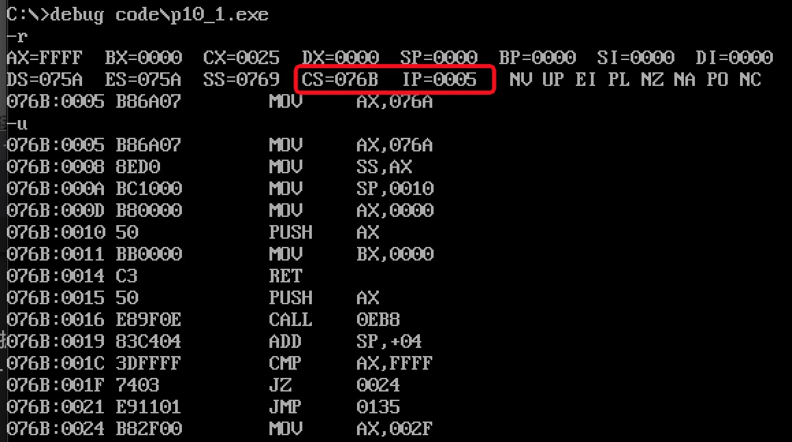

# CALL 和 RET 指令

`call` 和 `ret` 都是转移指令，经常配合使用来实现**子程序（函数调用）**。

> 类比 Rust：`call` ≈ 函数调用，`ret` ≈ 函数返回。底层实现就是通过栈保存/恢复返回地址。

## ret 和 retf

### ret — 近返回（段内）

`ret` 从栈中弹出 IP，实现段内转移，等同于 `pop IP`：

```
执行步骤：
1. IP = SS:SP 处的字
2. SP = SP + 2
```

### retf — 远返回（段间）

`retf` 依次弹出 IP 和 CS：

```
执行步骤：
1. IP = SS:SP 处的字；SP = SP + 2
2. CS = SS:SP 处的字；SP = SP + 2
```

**示例（ret）：**

```asm
assume cs:code

stack segment
    db 16 dup (0)
stack ends

code segment
    mov ax, 4c00h   ; 这是程序的第一条指令（偏移 0），用于退出
    int 21h

start:
    mov ax, stack
    mov ss, ax
    mov sp, 16
    mov ax, 0
    push ax         ; 将 0 压栈（作为返回地址，指向偏移 0 处的 mov ax,4c00h）
    mov bx, 0
    ret             ; IP = 0，跳转到 code:0 处，即 mov ax,4c00h
code ends

end start
```



## call 指令

CPU 执行 `call` 的两个步骤：

1. 将当前 IP（或 CS 和 IP）**压栈**（保存返回地址）
2. 跳转到目标地址

### 1. `call 标号`（近转移，依据位移）

```asm
push IP                 ; 保存下一条指令的地址
jmp near ptr 标号       ; 转移到标号
```

位移范围：`-32768~32767`。

### 2. `call far ptr 标号`（段间转移）

```asm
push CS
push IP
jmp far ptr 标号        ; CS:IP = 标号所在段:偏移
```

### 3. `call 16位寄存器`

```asm
push IP
jmp 16位寄存器          ; IP = (寄存器)
```

### 4. `call word ptr 内存单元`

```asm
push IP
jmp word ptr 内存单元   ; IP = (内存字)
```

示例：

```asm
mov sp, 10h
mov ax, 0123h
mov ds:[0], ax
call word ptr ds:[0]    ; 执行后 IP = 0123h，SP = 0Eh
```

### 5. `call dword ptr 内存单元`

```asm
push CS
push IP
jmp dword ptr 内存单元  ; IP = (内存低字)，CS = (内存高字)
```

示例：

```asm
mov sp, 10h
mov ax, 0123h
mov ds:[0], ax
mov word ptr ds:[2], 0
call dword ptr ds:[0]   ; 执行后 CS=0，IP=0123h，SP=0Ch
```

## call 和 ret 配合使用（子程序设计）

**基本模式：**

```asm
assume cs:code

code segment
start:
    mov ax, 1
    mov cx, 3
    call s          ; 将 IP（指向 mov bx,ax）压栈，跳到 s
    mov bx, ax      ; 从 s 返回后执行，bx = 8
    mov ax, 4c00h
    int 21h

s:  add ax, ax      ; ax = 1 → 2 → 4 → 8（循环 3 次）
    loop s
    ret             ; 弹出栈中保存的返回地址，跳回 call 的下一条指令
code ends

end start
```

> `call s` 执行时，将 `mov bx,ax` 的偏移地址压栈；`ret` 执行时弹出该地址，CPU 继续执行 `mov bx,ax`。

## 子程序设计标准框架

```asm
; 调用者
    mov 参数到指定寄存器
    call 子程序名
    ; 返回后继续...

; 子程序
子程序名:
    push 用到的寄存器   ; 保存现场
    ; ... 子程序逻辑 ...
    pop  用到的寄存器   ; 恢复现场（逆序 pop）
    ret                 ; 返回
```

**完整示例：** 计算 data 段中每个字的平方并存回

```asm
assume cs:code, ds:data

data segment
    dw 1, 2, 3, 4, 5, 6, 7, 8
data ends

code segment
start:
    mov ax, data
    mov ds, ax
    mov bx, 0
    mov cx, 8

s:  mov ax, ds:[bx]
    call square         ; 调用子程序，参数 ax，返回值 ax
    mov ds:[bx], ax
    add bx, 2
    loop s

    mov ax, 4c00h
    int 21h

square:                 ; 子程序：计算 ax * ax
    push cx             ; 保存 cx
    mov cx, ax
    mov ax, 0
sq_loop:
    add ax, [square 参数]  ; (简化示例，实际用 mul)
    ; ...实际用 mul ax 或循环累加
    pop cx
    ret
code ends
end start
```

## 分析 call/ret 与栈的关系

通过分析以下程序，理解 IP 在栈中的位置：

```asm
assume cs:code

data segment
    dw 8 dup (0)
data ends

code segment
start:
    mov ax, data
    mov ss, ax
    mov sp, 16

    mov word ptr ss:[0], offset s    ; 把 s 的偏移存入 ss:0
    mov ss:[2], cs                   ; 把当前 cs 存入 ss:2

    call dword ptr ss:[0]            ; 压入 CS 和 IP（nop 的地址）
    nop                              ; call 返回后执行这里
s:
    mov ax, offset s
    sub ax, ss:[0ch]    ; ax = s的偏移 - 栈中保存的IP（nop的偏移）= 1（nop 占1字节）
    mov bx, cs
    sub bx, ss:[0eh]    ; bx = cs - 栈中保存的CS = 0
    mov ax, 4c00h
    int 21h
code ends
end start
```

执行后：`ax = 1`（`nop` 占 1 字节），`bx = 0`（同一代码段）。
