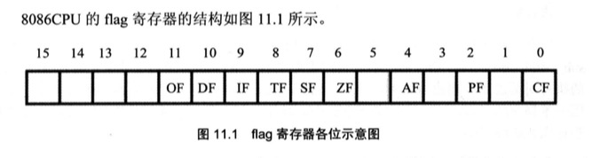
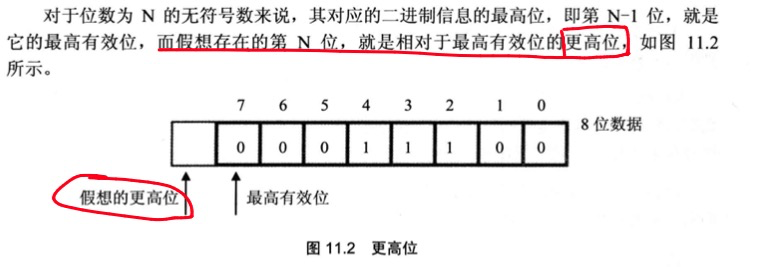

# 标志寄存器

标志寄存器（`FLAG`）是一个特殊的 16 位寄存器，按**位**起作用——每一位都有独立含义，记录特定信息，也称为**程序状态字（PSW，Program Status Word）**。

作用：

- 存储相关指令的执行结果（如是否溢出、是否为零）
- 为条件转移指令提供判断依据
- 控制 CPU 的工作方式（如方向标志、中断标志）



> **影响标志寄存器的指令：** `add, sub, mul, div, inc, dec, or, and`（运算指令）
> **不影响标志寄存器的指令：** `mov, push, pop, jmp`（传送指令）

## 各标志位详解

### ZF — 零标志位（Zero Flag） | 相关跳转：`JE` `JZ` `JNE` `JNZ`

记录指令执行结果**是否为 0**。结果为 0 → `ZF=1`；不为 0 → `ZF=0`。

```asm
mov ax, 1
sub ax, 1   ; 结果为 0 → ZF=1

mov ax, 2
sub ax, 1   ; 结果为 1 → ZF=0

mov ax, 1
and ax, 0   ; 结果为 0 → ZF=1
```

### PF — 奇偶标志位（Parity Flag） | 相关跳转：`JP` `JNP`

记录结果中 **1 的个数是否为偶数**。偶数 → `PF=1`；奇数 → `PF=0`。

```asm
mov al, 1
add al, 10  ; 结果 00001011b，3个1（奇数）→ PF=0

mov al, 1
or  al, 2   ; 结果 00000011b，2个1（偶数）→ PF=1
```

### SF — 符号标志位（Sign Flag） | 相关跳转：`JS` `JNS`

记录结果**是否为负**（以有符号数解释时）。负 → `SF=1`；非负 → `SF=0`。

```asm
mov al, 10000001b
add al, 1   ; 结果 10000010b
            ; 作为无符号：129+1=130，SF 有值但没意义
            ; 作为有符号：-127+1=-126，SF=1 表示结果为负
```

### CF — 进位标志位（Carry Flag） | 相关跳转：`JC` `JNC`

用于**无符号数**运算，记录最高有效位向更高位的**进位值**，或从更高位的**借位值**。

```asm
mov al, 98h
add al, al  ; 30h（进位了）→ CF=1

mov al, 97h
sub al, 98h ; 需要借位 → CF=1，结果 FFh
```



### OF — 溢出标志位（Overflow Flag） | 相关跳转：`JO` `JNO`

用于**有符号数**运算，记录是否发生了**溢出**。溢出 → `OF=1`；无溢出 → `OF=0`。

**CF 与 OF 的关键区别：**

| 标志 | 针对     | 含义                     |
| ---- | -------- | ------------------------ |
| CF   | 无符号数 | 最高位产生进位/借位      |
| OF   | 有符号数 | 结果超出有符号数表示范围 |

```asm
mov al, 98
add al, 99  ; CF=0（无符号无进位），OF=1（有符号溢出）

mov al, 0f0h
add al, 88h ; CF=1（无符号进位），OF=1（有符号溢出）

mov al, 0f0h
add al, 78h ; CF=1（无符号进位），OF=0（有符号不溢出）
```

### DF — 方向标志位（Direction Flag） | 相关：串操作

控制串处理指令（`movsb/movsw`）中 SI、DI 的增减方向。

- `DF=0`：SI/DI **递增**（正向，低地址→高地址）
- `DF=1`：SI/DI **递减**（反向，高地址→低地址）

设置方法：

```asm
cld   ; 将 DF 清 0（Clear Direction）
std   ; 将 DF 置 1（Set Direction）
```

## Debug 中标志位的显示符号

| 标志位     | 值=1 时显示 | 值=0 时显示 |
| ---------- | ----------- | ----------- |
| OF（溢出） | OV          | NV          |
| SF（符号） | NG（负）    | PL（正）    |
| ZF（零）   | ZR          | NZ          |
| PF（奇偶） | PE（偶）    | PO（奇）    |
| CF（进位） | CY          | NC          |
| DF（方向） | DN（递减）  | UP（递增）  |

## adc 指令（带进位加法）

```asm
adc 操作对象1, 操作对象2
; 功能：操作对象1 = 操作对象1 + 操作对象2 + CF
```

用途：进行超过 16 位的**大数加法**（分高低 16 位分别运算）：

```asm
; 计算 1EF000H + 20100H，结果存 AX（高16位）:BX（低16位）
mov ax, 001eh       ; 高 16 位：001EH
mov bx, 0f000h      ; 低 16 位：F000H
add bx, 0100h       ; 低位相加：F000H + 0100H = F100H，CF=0（无进位）
adc ax, 0020h       ; 高位相加带进位：001EH + 0020H + CF = 003EH
```

## sbb 指令（带借位减法）

```asm
sbb 操作对象1, 操作对象2
; 功能：操作对象1 = 操作对象1 - 操作对象2 - CF
```

用途：进行大数**减法**：

```asm
; 计算 003E1000H - 00202000H，结果存 AX:BX
mov bx, 1000h
mov ax, 003eh
sub bx, 2000h       ; 低位相减：1000H - 2000H，需借位，CF=1
sbb ax, 0020h       ; 高位相减带借位：003EH - 0020H - 1 = 001DH
```

## cmp 指令（比较）

`cmp` 相当于不保存结果的 `sub`，只影响标志寄存器：

```asm
cmp ax, bx          ; 计算 ax-bx，设置标志位，但 ax 不变
```

**无符号数比较（检测 ZF 和 CF）：**

| `cmp ax, bx` 结果 | ZF  | CF           |
| ----------------- | --- | ------------ |
| ax = bx           | 1   | 0            |
| ax ≠ bx           | 0   | -            |
| ax < bx           | 0   | 1            |
| ax ≥ bx           | 0   | 0            |
| ax > bx           | 0   | 0（且 ZF=0） |

**有符号数比较（检测 SF 和 OF）：**

| SF 和 OF   | 判断依据             | 结论        |
| ---------- | -------------------- | ----------- |
| SF=1, OF=0 | 无溢出，实际为负     | (ah) < (bh) |
| SF=1, OF=1 | 溢出，实际负但逻辑正 | (ah) > (bh) |
| SF=0, OF=1 | 溢出，实际正但逻辑负 | (ah) < (bh) |
| SF=0, OF=0 | 无溢出，实际为正     | (ah) ≥ (bh) |

## 条件转移指令完整表

### 无符号数跳转（检测 ZF / CF）

| 指令          | 含义                | 检测条件     |
| ------------- | ------------------- | ------------ |
| `je` / `jz`   | 等于 / 为零则跳     | ZF=1         |
| `jne` / `jnz` | 不等于 / 不为零则跳 | ZF=0         |
| `jb` / `jnae` | 低于则跳            | CF=1         |
| `jnb` / `jae` | 不低于则跳          | CF=0         |
| `ja`          | 高于则跳            | CF=0 且 ZF=0 |
| `jna` / `jbe` | 不高于则跳          | CF=1 或 ZF=1 |

### 有符号数跳转（检测 SF / OF / ZF）

| 指令          | 含义         | 检测条件      |
| ------------- | ------------ | ------------- |
| `jg` / `jnle` | 大于则跳     | ZF=0 且 SF=OF |
| `jge` / `jnl` | 大于等于则跳 | SF=OF         |
| `jl` / `jnge` | 小于则跳     | SF≠OF         |
| `jle` / `jng` | 小于等于则跳 | ZF=1 或 SF≠OF |

### 其他跳转

```asm
js    ; 为负则跳（SF=1）
jns   ; 不为负则跳（SF=0）
jc    ; 进位则跳（CF=1）
jnc   ; 不进位则跳（CF=0）
jo    ; 溢出则跳（OF=1）
jno   ; 不溢出则跳（OF=0）
jp    ; 奇偶位置位（PF=1）
jnp   ; 奇偶位清除（PF=0）
```

**条件转移编程示例：** 若 (ah)=(bh) 则 ah=ah+ah，否则 ah=ah+bh

```asm
cmp ah, bh
je  s           ; 相等则跳到 s
add ah, bh
jmp short ok
s:  add ah, ah
ok: ...
```

## movsb / movsw 串传送指令

`movsb` 将 `DS:SI` 处的字节送入 `ES:DI`，然后根据 DF 递增或递减 SI/DI：

```asm
; DF=0 时，movsb 等同于：
mov es:[di], byte ptr ds:[si]
inc si
inc di

; DF=1 时，movsb 等同于：
mov es:[di], byte ptr ds:[si]
dec si
dec di
```

`movsw` 传送字（2 字节），SI/DI 变化 ±2。

**配合 `rep` 循环传送（循环次数由 CX 控制）：**

```asm
; rep movsb 等同于：
s:  movsb
    loop s
```

**示例：** 将 data 段第一个字符串复制到后 16 字节

```asm
data segment
    db 'Welcome to masm!'
    db 16 dup (0)
data ends

code segment
    mov ax, data
    mov ds, ax
    mov si, 0           ; 源：data:0

    mov es, ax
    mov di, 16          ; 目标：data:16

    mov cx, 16
    cld                 ; DF=0，正向复制
    rep movsb
code ends
```

## pushf 和 popf

直接访问标志寄存器的方式：

```asm
pushf   ; 将 FLAG 寄存器压栈
popf    ; 从栈顶弹出数据送入 FLAG 寄存器
```

常用于保存/恢复标志寄存器状态（中断例程中尤为重要）。
