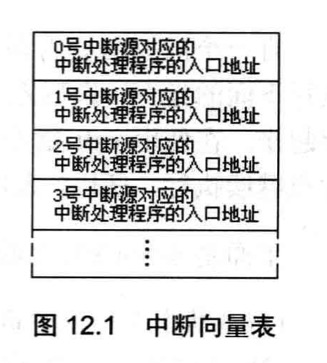

# 内中断

**中断**：CPU 在执行完当前指令后，检测到特殊信息，立即对其处理。这种特殊信息称为**中断信息**。

本章讨论来自 **CPU 内部**的中断（内中断）。

## 内中断的产生

8086 CPU 内部发生以下情况时产生中断信息：

| 中断源                       | 中断类型码      |
| ---------------------------- | --------------- |
| 除法错误（如 div 溢出）      | 0               |
| 单步执行（TF=1）             | 1               |
| 执行 into 指令（溢出则中断） | 4               |
| 执行 int n 指令              | n（指令中给出） |

**中断类型码**：一个字节（0~255），标识中断来源。

## 中断向量表

CPU 用中断类型码通过**中断向量表**找到中断处理程序的入口地址。

- 位置：内存 `0000:0000~0000:03FF`（前 1KB）
- 每个表项 4 字节：低 2 字节存偏移地址（IP），高 2 字节存段地址（CS）
- 256 个中断，每个占 4 字节



查找入口地址的方式：

```
中断类型码 N → 内存 N*4 处取 IP，N*4+2 处取 CS
```

## 中断过程（硬件自动完成）

CPU 收到中断信息后，自动执行以下步骤（程序员不可干预）：

```
1. 取中断类型码 N
2. pushf          ← 标志寄存器入栈
3. TF=0, IF=0     ← 防止中断处理时再次被打断
4. push CS
5. push IP
6. IP = (N*4)     ← 从中断向量表读取入口
   CS = (N*4+2)
```

执行完后，CPU 跳转到中断处理程序执行。

## 中断处理程序与 iret

中断处理程序（中断例程）的标准写法：

```asm
中断处理程序:
    push 用到的寄存器   ; 保存现场
    ; ... 处理中断 ...
    pop  用到的寄存器   ; 恢复现场
    iret                ; 返回：依次弹出 IP、CS、FLAG
```

`iret` 等同于：

```asm
pop IP
pop CS
popf
```

## 除法错误中断（0 号中断）处理

**任务：** 当发生除法溢出时，在屏幕中间显示 `divide error!` 并退出到 DOS。

**分析：**

- 中断处理程序 `do0` 需要常驻内存
- 利用中断向量表 `0000:0200~0000:02FF` 的空闲区存放 `do0`
- 将 `do0` 的入口 `0:200` 写入 0 号中断向量表项

**完整程序：**

```asm
assume cs:code

code segment

start:
    ; 第一步：将 do0 安装到内存 0:200 处
    mov ax, 0
    mov es, ax
    mov di, 200h              ; 目标：es:di = 0:200

    mov ax, cs
    mov ds, ax
    mov si, offset do0        ; 源：ds:si = cs:do0

    mov cx, offset do0end - offset do0   ; 复制长度
    cld
    rep movsb

    ; 第二步：设置中断向量表 0 号项
    mov ax, 0
    mov es, ax
    mov word ptr es:[0*4], 200h     ; 偏移地址 = 200h
    mov word ptr es:[0*4+2], 0      ; 段地址 = 0

    mov ax, 4c00h
    int 21h

do0:
    jmp short do0start
    db 'divide error!'              ; 字符串存放在指令后（偏移 0202h 处）

do0start:
    mov ax, cs
    mov ds, ax
    mov si, 0202h                   ; ds:si 指向字符串

    mov ax, 0b800h
    mov es, ax
    mov di, 160*12 + 40*2           ; 屏幕中间（12行40列）

    mov cx, 13                      ; 字符串长度
s:  mov al, ds:[si]
    mov es:[di], al
    mov byte ptr es:[di+1], 2       ; 绿色
    inc si
    add di, 2
    loop s

    mov ax, 4c00h
    int 21h

do0end: nop

code ends
end start
```

## 设置中断向量（通用写法）

```asm
; 将某中断处理程序的入口 seg:offset 写入 N 号中断向量表项
mov ax, 0
mov es, ax
mov word ptr es:[N*4],   偏移地址
mov word ptr es:[N*4+2], 段地址
```

## 单步中断（1 号中断）

当标志寄存器 `TF=1` 时，CPU 执行完每条指令后，产生 1 号单步中断。

这就是 Debug 的 `-t` 命令（单步跟踪）的底层实现：Debug 在每次单步前将 TF 置 1，执行完一条指令后通过 1 号中断例程暂停并显示寄存器状态。

中断过程中 `TF=0` 的原因：防止在执行中断处理程序时再次触发单步中断（否则陷入无限循环）。

## 响应中断的特殊情况

执行向 **SS 寄存器传送数据**的指令后，即使发生中断，CPU 也**不会响应**：

```asm
mov ss, ax    ; 执行完后不响应中断
mov sp, 100h  ; 这条指令执行完才可能响应中断
```

原因：SS 和 SP 需要一起设置（否则栈状态不一致），中间不允许被打断。
